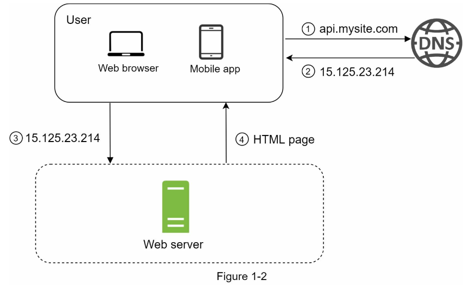

# Syetem Design
Reference: System Designer's Interview, An insider's guide by Alex Xu

### Single Server Setup
Considering a scenario for a system with 1 server

- Users access websites through domain names, such as api.mysite.com. Usually, the Domain Name System (DNS) is a paid service provided by 3rd parties and not hosted by our servers.
- Internet Protocol (IP) address is returned to the browser or mobile app. In the example, IP address 15.125.23.214 is returned.
- Once the IP address is obtained, Hypertext Transfer Protocol (HTTP) [1] requests are sent directly to your web server.
- The web server returns HTML pages or JSON response for rendering.


Traffic Sources here can be the follows:
1. Web Application: It uses a combination of server-side languages (Java, Python, etc.) to handle business logic, storage, etc., and client-side languages (HTML and JavaScript) for presentation. 
2. Mobile Application: <u>HTTP protocol is the communication protocol between the mobile app and the web server.</u>  JavaScript Object Notation (JSON) is commonly used API response format to transfer data due to its simplicity. An example of the API response in JSON format is shown below

### Vertical scaling vs horizontal scaling
| Vertical Scaling | Horizontal Scaling |
|------------------|--------------------|
|Vertical scaling referred to as “scale up”, means the process of adding more power (CPU, RAM, etc.) to your servers.| Horizontal scaling, referred to as “scale-out”, allows you to scale by adding more servers into your pool of resources.|
|When traffic is low, vertical scaling is a great option, the simplicity of vertical scaling is its main advantage | Horizontal scaling is more desirable for large scale applications due to the limitations of vertical scaling. |

**Limitation of Vertical Scaling**
- Vertical scaling has a hard limit. It is impossible to add unlimited CPU and memory to a single server.
- Vertical scaling does not have failover and redundancy. If one server goes down, the website/app goes down with it completely.


## Components and Key Terms

### Database
With the growth of the user base, one server is not enough, we need multiple servers:
- one for web/mobile traffic
- other for database

Separating web/mobile traffic (web tier) and database (data tier) servers allows them to be scaled independently.

**Which Database to use?**
- Traditional Database(RDBMS)
  - Relational databases represent and store data in tables and rows.
  - You can perform join operations using SQL across different database tables.
  - The most popular ones are MySQL, Oracle database, PostgreSQL, etc. 
- Non-Relational Database
  - These databases are grouped into four categories: 
    - key-value stores
    - graph stores
    - column stores
    - document stores
  - Popular ones are CouchDB, Neo4j, Cassandra, HBase, Amazon DynamoDB, etc.

Non-relational databases might be the right choice if:
- Your application requires super-low latency.
- Your data are unstructured, or you do not have any relational data.
- You only need to serialize and deserialize data (JSON, XML, YAML, etc.). 
- You need to store a massive amount of data. 

```Latency: The delay before a transfer of data begins following an instruction for its transfer```