# Syetem Design
Reference: System Designer's Interview, An insider's guide by Alex Xu

### Single Server Setup
Considering a scenario for a system with 1 server
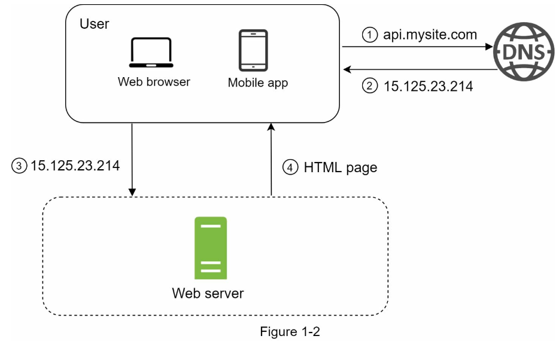
- Users access websites through domain names, such as api.mysite.com. Usually, the Domain Name System (DNS) is a paid service provided by 3rd parties and not hosted by our servers.
- Internet Protocol (IP) address is returned to the browser or mobile app. In the example, IP address 15.125.23.214 is returned.
- Once the IP address is obtained, Hypertext Transfer Protocol (HTTP) [[1]](https://en.wikipedia.org/wiki/Hypertext_Transfer_Protocol) requests are sent directly to your web server.
- The web server returns HTML pages or JSON response for rendering.


Traffic Sources here can be the follows:
1. Web Application: It uses a combination of server-side languages (Java, Python, etc.) to handle business logic, storage, etc., and client-side languages (HTML and JavaScript) for presentation. 
2. Mobile Application: <u>HTTP protocol is the communication protocol between the mobile app and the web server.</u>  JavaScript Object Notation (JSON) is commonly used API response format to transfer data due to its simplicity. An example of the API response in JSON format is shown below

### Vertical scaling vs horizontal scaling
| Vertical Scaling | Horizontal Scaling |
|------------------|--------------------|
|Vertical scaling referred to as “scale up”, means the process of adding more power (CPU, RAM, etc.) to your servers.| Horizontal scaling, referred to as “scale-out”, allows you to scale by adding more servers into your pool of resources.|
|When traffic is low, vertical scaling is a great option, the simplicity of vertical scaling is its main advantage | Horizontal scaling is more desirable for large scale applications due to the limitations of vertical scaling. |

**Limitation of Vertical Scaling**
- Vertical scaling has a hard limit. It is impossible to add unlimited CPU and memory to a single server.
- Vertical scaling does not have failover and redundancy. If one server goes down, the website/app goes down with it completely.


## Components and Key Terms

### Database
With the growth of the user base, one server is not enough, we need multiple servers:
- one for web/mobile traffic
- other for database

Separating web/mobile traffic (web tier) and database (data tier) servers allows them to be scaled independently.

**Which Database to use?**
- Traditional Database(RDBMS)
  - Relational databases represent and store data in tables and rows.
  - You can perform join operations using SQL across different database tables.
  - The most popular ones are MySQL, Oracle database, PostgreSQL, etc. 
- Non-Relational Database
  - These databases are grouped into four categories: 
    - key-value stores
    - graph stores
    - column stores
    - document stores
  - Popular ones are CouchDB, Neo4j, Cassandra, HBase, Amazon DynamoDB, etc.

Non-relational databases might be the right choice if:
- Your application requires super-low latency.
- Your data are unstructured, or you do not have any relational data.
- You only need to serialize and deserialize data (JSON, XML, YAML, etc.). 
- You need to store a massive amount of data. 

```Latency: The delay before a transfer of data begins following an instruction for its transfer```


### Load balancer
If many users access the web server simultaneously and it reaches the web server’s load limit, users generally experience slower response or fail to connect to the server. A load balancer is the best technique to address these problems.

A load balancer evenly distributes incoming traffic among web servers that are defined in a load-balanced set.

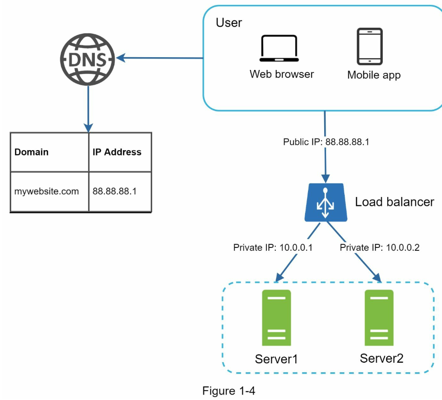

With this setup, web servers are unreachable directly by clients anymore. For better security, private IPs are used for communication between servers. *The load balancer communicates with web servers through private IPs.*


```A private IP is an IP address reachable only between servers in the same network; however, it is unreachable over the internet.```

Through the help of load balancer we can solve the issue of *no failover* and improved the availability of the web tier. This was achieved as follows:
- If server 1 goes offline, all the traffic will be routed to server 2. This prevents the website from going offline. We will also add a new healthy web server to the server pool to balance the load.
- If the website traffic grows rapidly, and two servers are not enough to handle the traffic, the load balancer can handle this problem gracefully. You only need to add more servers to the web server pool, and the load balancer automatically starts to send requests to them.

### Data Replication
The current design has one database, so it does not support failover and redundancy. Database replication is a common technique to address those problems.

Database replication can be used in many database management systems, usually with a master/slave relationship between the original (master) and the copies (slaves).
- A master database generally only supports write operations. 
- A slave database gets copies of the data from the master database and only supports read operations.
- All the data-modifying commands like insert, delete, or update must be sent to the master database.
- Most applications require a much higher ratio of reads to writes; thus, the number of slave databases in a system is usually larger than the number of master databases.

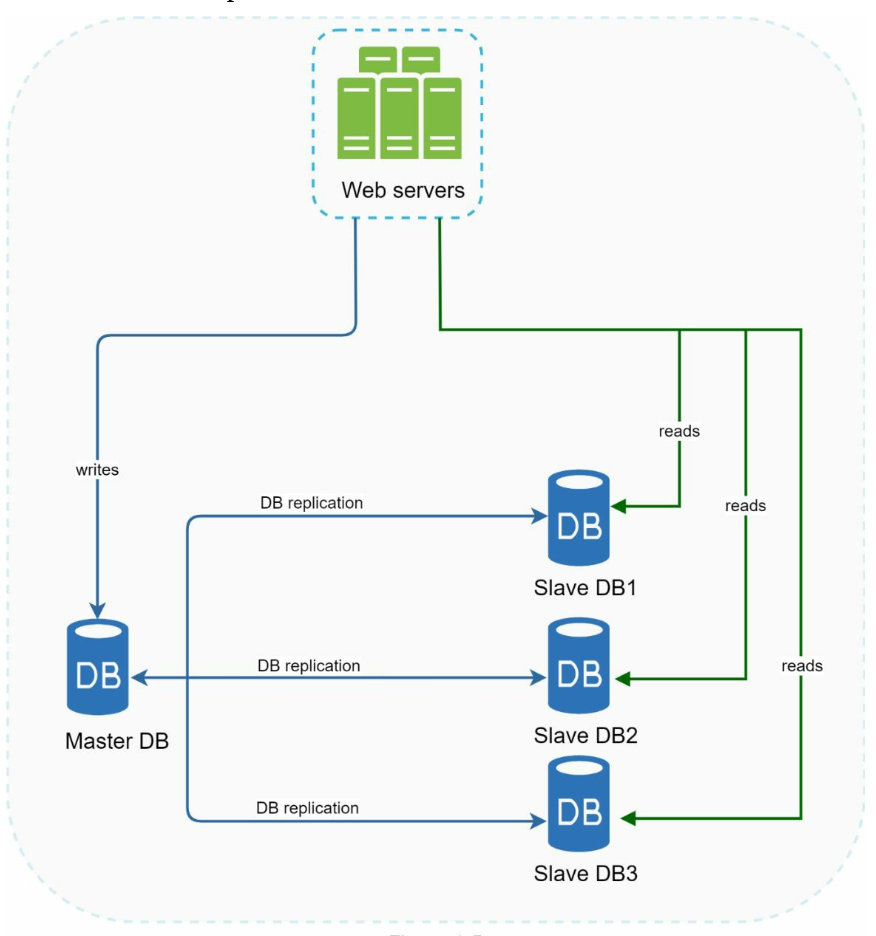


Advantages of database replication:
- Better performance: 
  - All writes and updates happen in master nodes whereas, read operations are distributed across slave nodes. 
  - This model improves performance because it allows more queries to be processed in parallel. 
- Reliability:
	- If one of your database servers is destroyed by a natural disaster, such as a typhoon or an earthquake, data is still preserved. You do not need to worry about data loss because data is replicated across multiple locations.
- High availability:
  - By replicating data across different locations, your website remains in operation even if a database is offline as you can access data stored in another database server.

<br>

```
Q. What if one of the databases goes offline?

* Case #1: Only one slave database is available and it goes offline.
- Read operations will be directed to the master database temporarily. As soon as the issue is found, a new slave database will replace the old one.

* Case #2: Multiple slave databases are available.
- Read operations are redirected to other healthy slave databases. A new database server will replace the old one.

* Case #3: The master database goes offline
- A slave database will be promoted to be the new master
- All the database operations will be temporarily executed on the new master database.
- A new slave database will replace the old one for data replication immediately.
```

#### NOTES:
Complexities of promoting a new Master:
  - In production systems, promoting a new master is more complicated as the data in a slave database might not be up to date. 
  - The missing data needs to be updated by running data recovery scripts.
  - Although some other replication methods like [multi-masters](https://en.wikipedia.org/wiki/Multi-master_replication) and circular replication could help, those setups are more complicated

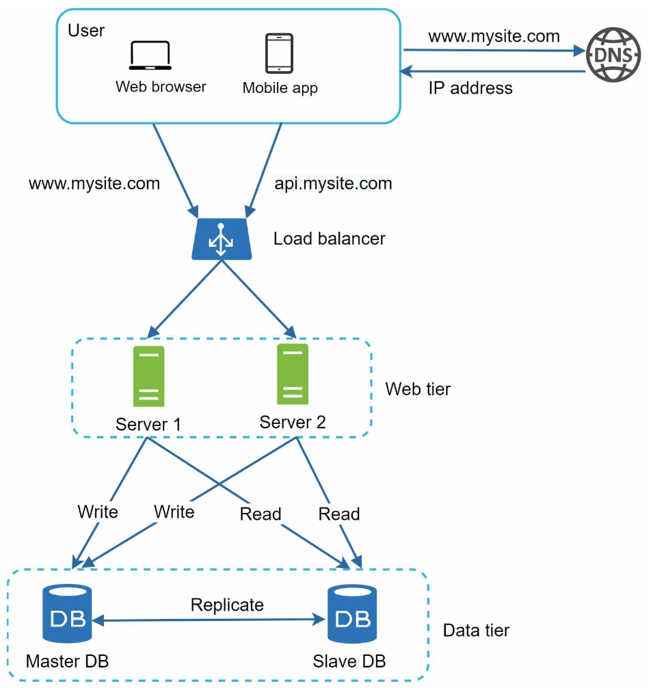
- A user gets the IP address of the load balancer from DNS. 
- A user connects the load balancer with this IP address. 
- The HTTP request is routed to either Server 1 or Server 2. 
- A web server reads user data from a slave database.
- A web server routes any data-modifying operations to the master database. This includes write, update, and delete operations.


### Cache
A cache is a temporary storage area that stores the result of expensive responses or frequently accessed data in memory so that subsequent requests are served more quickly.

Every time a new web page loads, one or more database calls are executed to fetch data, in result the application performance is greatly affected by calling the database repeatedly.

### Cache Tier
The cache tier is a temporary data store layer, much faster than the database.

The benefits of having a separate cache tier include
- better system performance
- ability to reduce database workloads
- the ability to scale the cache tier independently

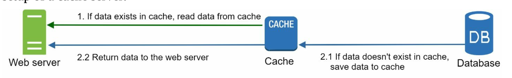

After receiving a request, a web server first checks if the cache has the available response. If it has, it sends data back to the client. If not, it queries the database, stores the response in cache, and sends it back to the client.
This caching strategy is called a **read-through cache**.

Other caching strategies are available depending on the data type, size, and access pattern.


### Caching Strategies and How to Choose the Right One
Reference: https://codeahoy.com/2017/08/11/caching-strategies-and-how-to-choose-the-right-one/

If done right, caches can reduce response times, decrease load on database, and save costs. There are several strategies and choosing the right one can make a big difference.

Your caching strategy depends on the data and data access patterns. In other words, how the data is written and read.

- is the system write heavy and reads less frequently? (e.g. time based logs)
- is data written once and read multiple times? (e.g. User Profile)
- is data returned always unique? (e.g. search queries)

A caching strategy for Top-10 leaderboard system for mobile games will be very different than a service which aggregates and returns user profiles.


#### Cache-Aside
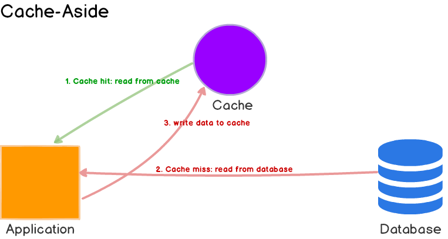

**Use cases**
- General purpose, and used for read-heavy workloads

**Pros**
- If the cache cluster goes down, the system can still operate by going directly to the database.
- Data model in cache can be different than the data model in database. (response generated as a result of multiple queries can be stored against some request id.)

**Cons**
- It doesn’t help much if cache goes down during peak load. Response times can become terrible and in worst case, the database can stop working.

**Write Startegy**
The most common write startegy is to write the data directly to the database but this may lead to incosistency of cache.

Developers' use TTL strategy to deal with this. The cache keeps serving stale data till TTL expires.

#### Read-Through Cache
Read-through cache sits in-line with the database. When there is a cache miss, it loads missing data from database, populates the cache and returns it to the application.

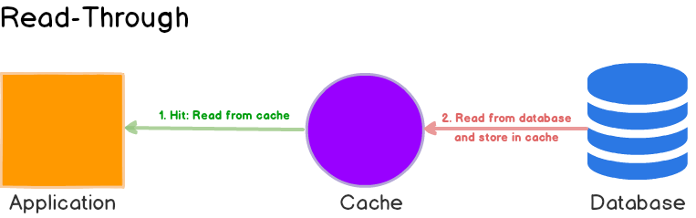
Both cache-aside and read-through strategies load data lazily, that is, only when it is first read.

**Differences between cache-a-side and read-through cache**
1. In cache-aside, the application is responsible for fetching data from the database and populating the cache. In read-through, this logic is usually supported by the library or stand-alone cache provider.
2. Unlike cache-aside, the data model in read-through cache cannot be different than that of the database.

**Pros**
- Read-through caches work best for read-heavy workloads when the same data is requested many times.

**Cons**
- When the data is requested the first time, it always results in cache miss and incurs the extra penalty of loading data to the cache.

  Developers deal with this by ‘warming’ or ‘pre-heating’ the cache by issuing queries manually.
- Just like cache-aside, it is also possible for data to become inconsistent between cache and the database, and solution lies in the write strategy, as we’ll see next.

#### Write-Through Cache
In this write strategy, data is first written to the cache and then to the database. The cache sits in line with the database and writes always go through the cache to the main database. This helps cache maintain consistency with the main database.

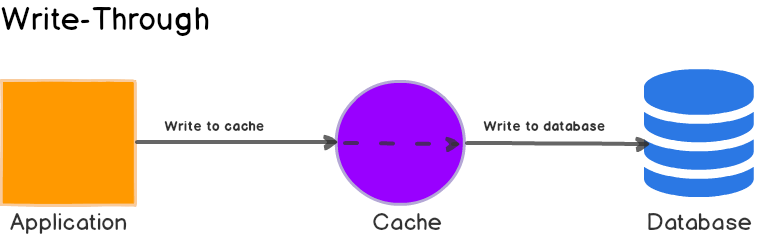

On its own, write-through caches don’t seem to do much, in fact, they introduce extra write latency because data is written to the cache first and then to the main database (two write operations.)

But when paired with read-through caches, we get all the benefits of read-through and we also get data consistency guarantee, freeing us from using cache invalidation (assuming ALL writes to the database go through the cache.)

Example: 
[DynamoDB Accelerator(DAX)](https://docs.aws.amazon.com/amazondynamodb/latest/developerguide/DAX.consistency.html)

#### Write Around Cache
Here, data is written directly to the database and only the data that is read makes it way into the cache.

**Uses:**

Write-around can be combine with read-through and provides good performance in situations where data is written once and read less frequently or never. 

Example: Realtime logs, chatroom messages

#### Write-Back or Write-Behind
Here, the application writes data to the cache which stores the data and acknowledges to the application immediately. Then later, the cache writes the data back to the database.

**Difference between Write-Through and Write-Behind cache**
- In Write-Through, the data written to the cache is synchronously updated in the main database. In Write-Back, the data written to the cache is asynchronously updated in the main database. 
- From the application perspective, writes to Write-Back caches are faster because only the cache needed to be updated before returning a response.

**Pros**
- Write back caches improve the write performance and are good for write-heavy workloads. When combined with read-through, it works good for mixed workloads, where the most recently updated and accessed data is always available in cache.
- It’s resilient to database failures and can tolerate some database downtime. If batching or coalescing is supported, it can reduce overall writes to the database, which decreases the load and reduces costs, if the database provider charges by number of requests


**NOTES:**
- Batching, coalescing means that you only send the latest mutation on a per key basis to the CacheLoaderWriter.
- Mutations are used to send data updates to the server and apply the changes to the local cache.

### Considerations for using a cache
- Consider using cache when data is read frequently but modified infrequently.

  Since cached data is stored in volatile memory, a cache server is not ideal for persisting data. For instance, if a cache server restarts, all the data in memory is lost. 
  
  Thus, important data should be saved in persistent data stores.

- Expiration policy. It is a good practice to implement an expiration policy. Once cached data is expired, it is removed from the cache. When there is no expiration policy, cached data will be stored in the memory permanently.

  It is advisable not to make the expiration date too short as this will cause the system to reload data from the database too frequently. Meanwhile, it is advisable not to make the expiration date too long as the data can become stale.

- Consistency: This involves keeping the data store and the cache in sync. Inconsistency can happen because data-modifying operations on the data store and cache are not in a single transaction.

  When scaling across multiple regions, maintaining consistency between the data store and cache is challenging.

- Mitigating failures: A single cache server represents a potential single point of failure (SPOF). As a result, multiple cache servers across different data centers are recommended to avoid SPOF. 

- Eviction Policy: Once the cache is full, any requests to add items to the cache might cause existing items to be removed. This is called cache eviction.

  Least-recently-used (LRU) is the most popular cache eviction policy. Other eviction policies, such as the Least Frequently Used (LFU) or First in First Out (FIFO), can be adopted to satisfy different use cases.

### Content Delivery Network(CDN)
A CDN is a network of geographically dispersed servers used to deliver static content. CDN servers cache static content like CSS, JSfiles, images, videos, etc. It enables the caching of HTML pages that are based on request path, query strings, cookies, and request headers.

Here is how CDN works at the high-level: when a user visits a website, a CDN server closest to the user will deliver static content. Intuitively, the further users are from CDN servers, the slower the website loads.

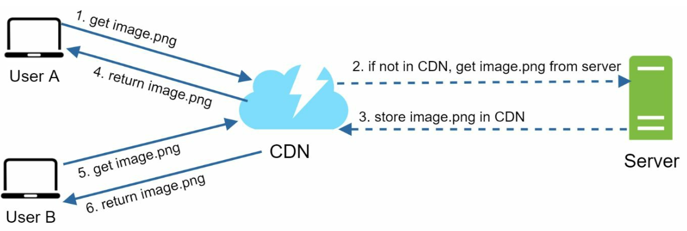


Considerations of using a CDN
- CDN fallback: You should consider how your website/application copes with CDN failure. If there is a temporary CDN outage, clients should be able to detect the problem and request resources from the origin.

### Architecture After CDN Addition
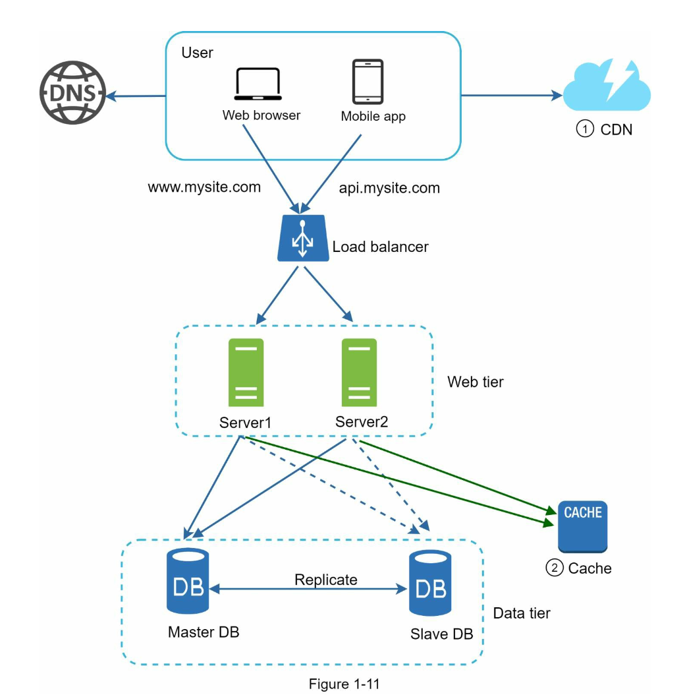

1. Static assets (JS, CSS, images, etc.,) are no longer served by web servers. They are fetched from the CDN for better performance.
2. The database load is lightened by caching data.

### Stateless web tier
A good practice is to store session data in the persistent storage such as relational database or NoSQL. Each web server in the cluster can access state data from databases. This is called stateless web tier.

### Stateful architecture
A stateful server remembers client data (state) from one request to the next. A stateless server keeps no state information.
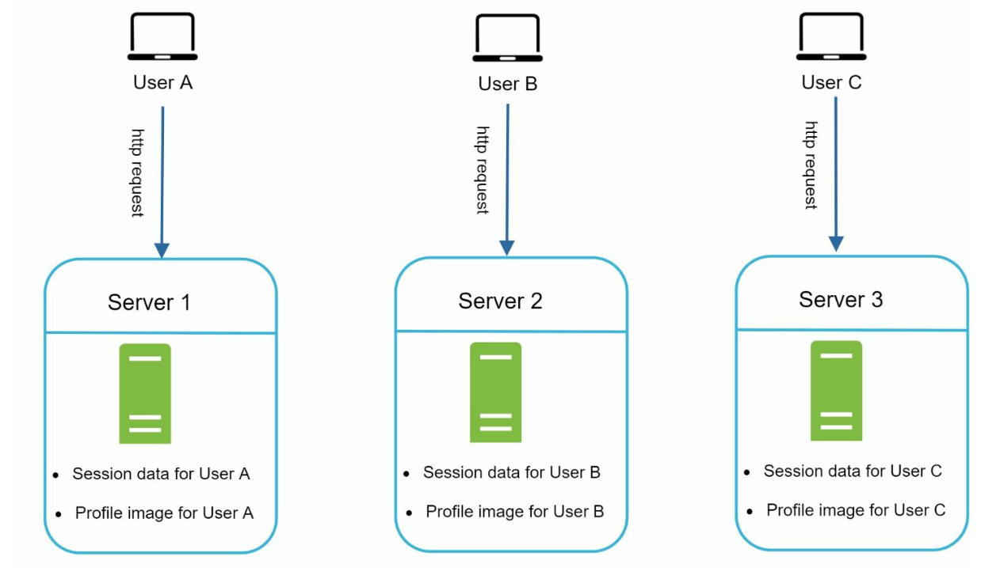

- User A’s session data and profile image are stored in Server 1. To authenticate User A, HTTP requests must be routed to Server 1. 
- If a request is sent to other servers like Server 2, authentication would fail because Server 2 does not contain User A’s session data. Similarly, all HTTP requests from User B must be routed to Server 2; all requests from User C must be sent to Server 3.
- The issue is that every request from the same client must be routed to the same server. This can be done with sticky sessions in most load balancers; however, this adds the overhead. Adding or removing servers is much more difficult with this approach. It is also challenging to handle server failures.


### Stateless Architecture
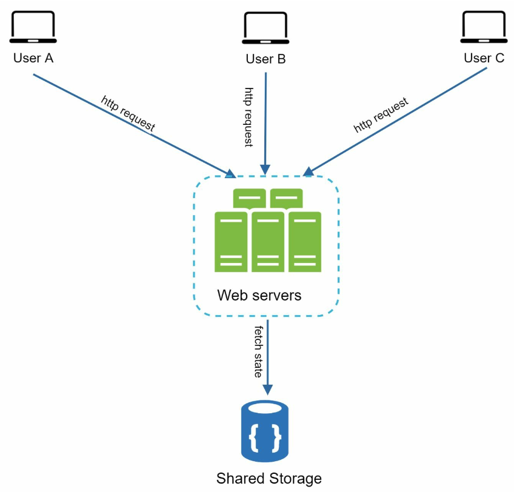

In this stateless architecture, HTTP requests from users can be sent to any web servers, which fetch state data from a shared data store. State data is stored in a shared data store and kept out of web servers. A stateless system is simpler, more robust, and scalable.


#### Architecture After stateless web tier
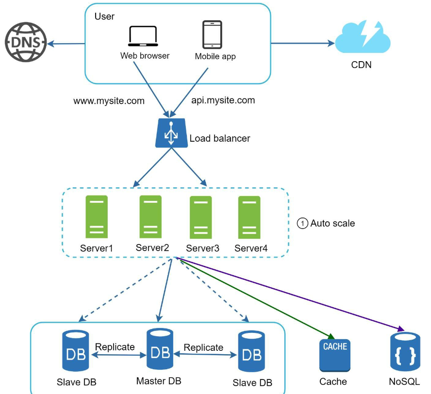

- We move the session data out of the web tier and store them in the persistent data store.
- The shared data store could be a relational database, Memcached/Redis, NoSQL, etc. The NoSQL data store is chosen as it is easy to scale.
- Autoscaling means adding or removing web servers automatically based on the traffic load. After the state data is removed out of web servers, auto-scaling of the web tier is easily achieved by adding or removing servers based on traffic load.

### Data centers
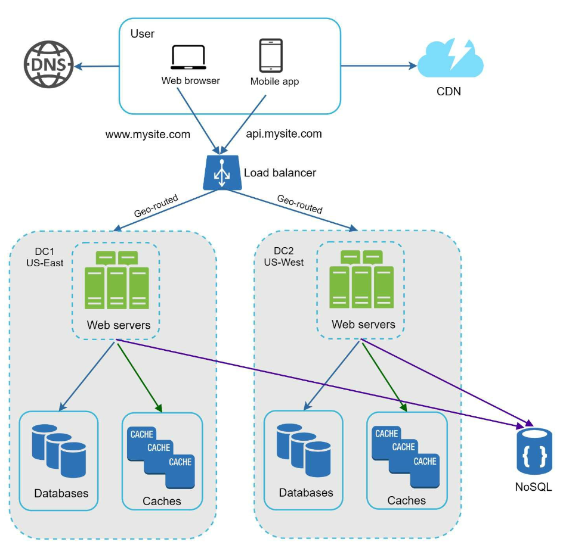
- In normal operation, users are geoDNS-routed, also known as geo-routed, to the closest data center, with a split traffic of x% in US-East and (100 – x)% in US-West.
- geoDNS is a DNS service that allows domain names to be resolved to IP addresses based on the location of a user.
- In the event of any significant data center outage, we direct all traffic to a healthy data center.

Several technical challenges must be resolved to achieve multi-data center setup:
-  Traffic redirection: Effective tools are needed to direct traffic to the correct data center. GeoDNS can be used to direct traffic to the nearest data center depending on where a user is located.
- Data synchronization: Users from different regions could use different local databases or caches. In failover cases, traffic might be routed to a data center where data is unavailable. A common strategy is to replicate data across multiple data centers.
- Test and deployment: With multi-data center setup, it is important to test your website/application at different locations. Automated deployment tools are vital to keep services consistent through all the data centers

### Message Queue
- A message queue is a durable component, stored in memory, that supports asynchronous communication.
- It serves as a buffer and distributes asynchronous requests.
- Basic Architecture: Input services, called producers/publishers, create messages, and publish them to a message queue
- Other services or servers, called consumers/subscribers, connect to the queue, and perform actions defined by the messages.

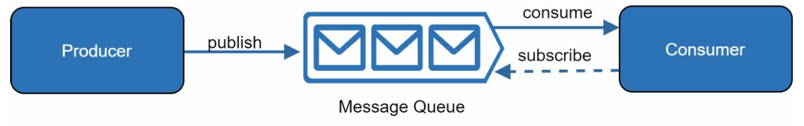

- Decoupling makes the message queue a preferred architecture for building a scalable and reliable application.
- With the message queue, the producer can post a message to the queue when the consumer is unavailable to process it. The consumer can read messages from the queue even when the producer is unavailable.

#### Use case
An application supports photo customization, including cropping, sharpening, blurring, etc. Those customization tasks take time to complete.

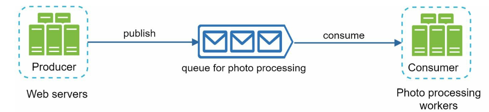
- Web servers publish photo processing jobs to the message queue.
- Photo processing workers pick up jobs from the message queue and asynchronously perform photo customization tasks.
- The producer and the consumer can be scaled independently. When the size of the queue becomes large, more workers are added to reduce the processing time. However, if the queue is empty most of the time, the number of workers can be reduced.